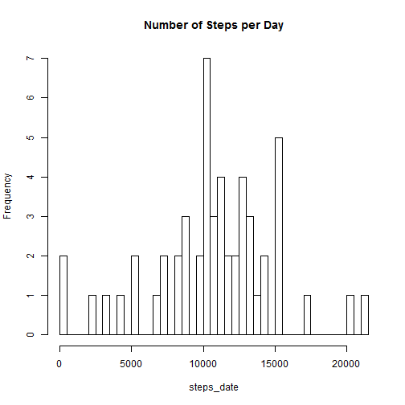
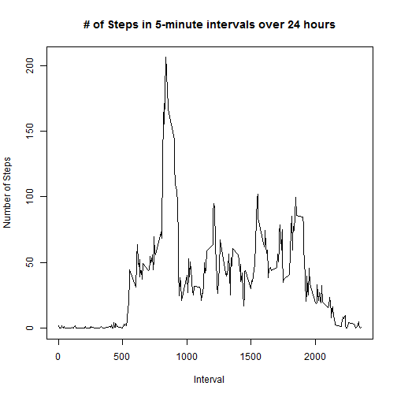
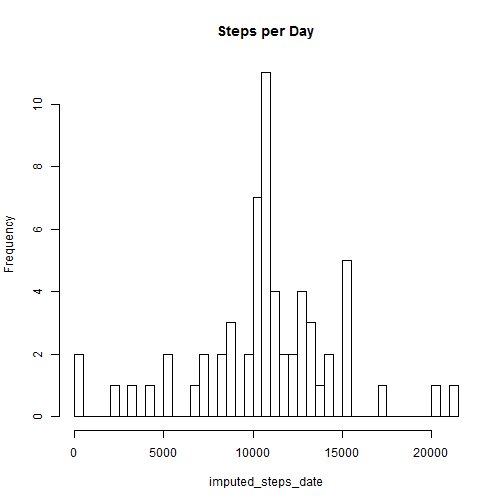
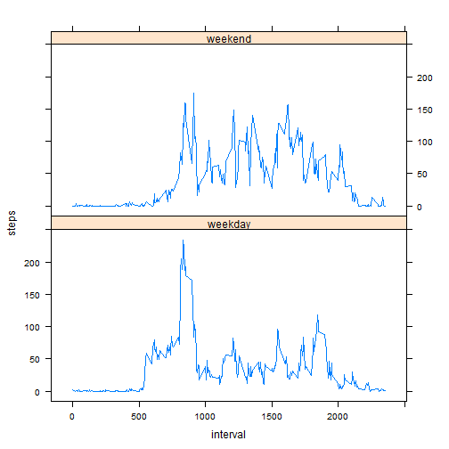

# Reproducible Research: Peer Assessment 1


This report was produced at Sun Aug 17 4:25:56 PM 2014.

## Loading and preprocessing the data

```r
activity_raw <- read.csv("./activity.csv")
activity_raw$date <- as.Date(activity_raw$date, format = "%Y-%m-%d")
activity <- activity_raw
activity_clean <- activity[complete.cases(activity),]
activity_clean$date <- as.Date(activity_clean$date, format = "%Y-%m-%d")
```

## What is mean total number of steps taken per day?

```r
#Aggregate the data by date
    steps_date <- tapply(activity_clean$steps,activity_clean$date, sum)

    #Make a histogram of the total number of steps taken each day
    hist(steps_date, breaks = length(steps_date),main = "Number of Steps per Day")
```

 

```r
    #Calculate and report the mean and median total number of steps taken per day
    steps_med <- median(steps_date)
    steps_mean <- mean(steps_date)
```
The median number of steps is 10765 and the mean number of steps 
is 1.0766 &times; 10<sup>4</sup>.  
  

## What is the average daily activity pattern?

```r
    #Aggregate steps taken by interval of time
    activity_interval <- tapply(activity_clean$steps,activity_clean$interval,mean)
```

Make a time series plot i.e., type = "l" of the 5 minute interval and 
the average number of steps taken, averaged across all days (y-axis)


```r
    plot(names(activity_interval),activity_interval, main = "# of Steps in 5-minute intervals over 24 hours",xlab = "Interval",ylab = "Number of Steps",type = "l")
```

 

Which 5-minute interval, on average across all the days in the dataset, 
contains the maximum number of steps?


```r
    ind <- which(activity_interval == max(activity_interval), arr.ind=T)
    interval <- rownames(ind)
```

The 835 interval contains the maximum number of steps.

## Imputing missing values
1. Calculate and report the total number of missing values in the dataset

```r
    missing <- sum(!complete.cases(activity_raw))
    total_rows <- nrow(activity_raw)
```

There are 2304 missing values out of 17568 total values in the dataset.  

The following code replaces NAs with the interval average across all days: 

```r
    #2-3.Replace NAs with the average number of steps in the interval across
    #all dates and create a new dataset with the missing data filled in
    activity_new <- activity_raw    
    activity_new$steps[is.na(activity_new$steps)] <- ave(activity_new$steps,
                                            activity_new$interval,
                                            FUN = function(x)mean(x,
                                            na.rm = T))[is.na(activity_new$steps)]
```


4.Make a histogram of the total number of steps taken each day and calculate
  and report the mean and median total number of steps taken each day


```r
    activity_new$date <- as.factor(activity_new$date)    
    imputed_steps_date <- tapply(activity_new$steps,activity_new$date,sum)    
    hist(imputed_steps_date,breaks = length(imputed_steps_date),main = "Steps per Day")
```

 

```r
    imputed_steps_median <- median(imputed_steps_date)
    imputed_steps_mean <- mean(imputed_steps_date)
```
The median number of steps per day is 1.0766 &times; 10<sup>4</sup> and the mean number of steps per day is 1.0766 &times; 10<sup>4</sup>.  

4. (continued) Do these values differ from the estimates from the first part of the assgnmt?  
  
    No, these values do not differ significantly from the estimates which removed NA values.

What is the impact of imputing missing data on the estimates of the total
number of daily steps?

The impact was neglible when NAs were replaced with the average steps per interval across all dates.


## Are there differences in activity patterns between weekdays and weekends?
Yes, the weekday activity peaked in the morning while weekend activity was 
spread more evenly over the day.

1. Create a new factor variable in the dataset with two levels - "weekday"
    #and "weekend" indicating whether a given date is a weekday or a weekend day
    #Note: Determined weekdays and weekends using POSIXlt (0-6 starting on Sunday)


```r
    activity$dayofweek <- as.POSIXlt(activity$date)$wday
    activity$weekendorday = ifelse(activity$dayofweek == 0 | 
                            activity$dayofweek == 6,"weekend","weekday")
    activity$weekendorday <- as.factor(activity$weekendorday)
```


2. Make a panel plot containing a time series plot i.e., type = l of the 
   5-minute interval (x-axis) and the average number of steps taken, averaged
   across all weekday days or weekend days (y-axis).


```r
    activity_date <- activity[,c(5,3,1)]
    activity_week <- aggregate(steps ~weekendorday + interval,
                           FUN = mean,data=activity_date)
    with(activity_week,xyplot(steps ~ interval | weekendorday, 
                          type = "l",layout = c(1,2)))
```

 
